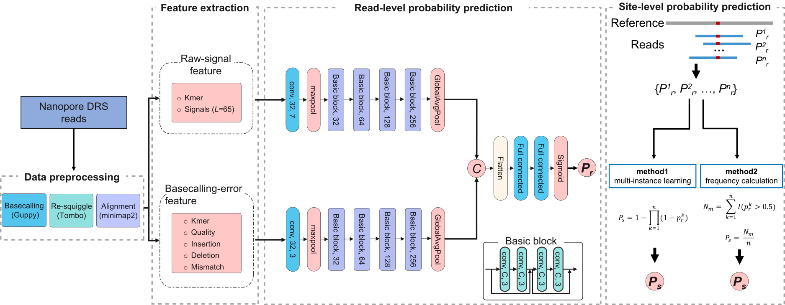

# RedNano

RedNano is a deep-learning method that utilizes both raw signals and basecalling errors to detect m6A from Nanopore DRS reads.



# Contents
- [RedNano](#rednano)
- [Contents](#contents)
- [Installation](#installation)
    - [Clone repository](#clone-repository)
    - [Install dependencies](#install-dependencies)
- [Demo data](#demo-data)
- [Usage](#usage)
    - [Preproccess](#preproccess)
    - [Feature extraction](#feature-extraction)
    - [Predicting m6A site](#predicting-m6a-site)
    - [Trainning model](#trainning-model)

# Installation

### Clone repository

Download RedNano from the github repository

    git clone https://github.com/Derryxu/RedNano.git

### Install dependencies

Install conda environment

```
conda env create -f RedNano.yml
```

Following list shows the main environmental dependencies, please make sure the dependences are installed.

| soft or module | version |
| -------------- | ------- |
|Python | 3.7|
|Pytorch |  1.10.0 |
|CUDA Version |  11.1|
|ont-fast5-api | 4.0.2|
|ont-tombo | 1.5.1|
|minimap2 | 2.17|
|samtools | 1.7 |
|h5py | 3.4.0|
|statsmodels | 0.13.1|
|tqdm | 4.62.3|
|scikit-learn | 0.19.2|

Other necessary tools used:
- [Guppy (v3.1.5)](https://community.nanoporetech.com/getting_started)
- [jvarkit](https://github.com/lindenb/jvarkit)

# Demo data
Check [demo](/demo) to get some demo data:
  - _fast5_: fast5 files.
  - _cc.fasta_: reference transcriptome.
  - _cc.bed_: reference transcriptome length file with a header.

All the demo data are downloaded from the [Liu et al.-Nat Comm-2019](https://www.nature.com/articles/s41467-019-11713-9) paper.

# Usage

This section highlights the main functionalities of RedNano and the commands to run them.

### Preproccess

1. **Converts multi read FAST5 file(s) into single read FAST5 files if necessary.**

   When the downloaded Fast5 file(s) of raw nanopore sequencing reads contains multiple reads-id, use ont_fast5_api to split the multiple read Fast5 file(s) into single read Fast5 files.

```shell
multi_to_single_fast5 -i /path/to/fast5/ -s /path/to/fast5_single --recursive -t 30
```

2. **Basecalling using guppy (v3.1.5)**

```shell
guppy_basecaller -i /path/to/fast5/ -r -s /path/to/fast5_guppy --fast5_out -c rna_r9.4.1_70bps_hac.cfg --gpu_runners_per_device 2 --chunks_per_runner 2500 --device CUDA:0

# Merge all fastq files into one file, use poretools or nanopolish to extract the fastq files from fast5 files first if necessary
cat /path/to/fast5_guppy/*.fastq > test.fastq
```

3. **resquiggle raw signals**

   The tombo (v1.5.1) resquiggle referance.transcript.fa should not be genome file, it should be the referance gene fasta file.

```shell
tombo resquiggle --overwrite /path/to/fast5_guppy/workspace/ --basecall-group Basecall_1D_001 referance.transcript.fa --fit-global-scale --include-event-stdev --corrected-group RawGenomeCorrected_001 --processes 30
```

4. **Map reads to reference transcriptome**

   Map the nanopore reads to reference transcriptome  using minimap2 (v2.17-r941)

   Convert the output BAM format files to TSV format files using samtools (v1.7) and sam2tsv (of jvarkit) 

```shell
minimap2 -t 30 -ax map-ont /path/to/referance.transcript.fa /test.fastq | samtools view -hSb | samtools sort -@ 30 -o test.bam
samtools index test.bam
samtools view -h -F 3844 test.bam | java -jar sam2tsv.jar -r referance.transcript.fa > test.tsv
```

4. **Split  test.tsv file**

   To allow downstream parallelisation of the feature extraction, the generated test.tsv is split into the different reads in a tmp folder.

```shell
mkdir tmp
awk 'NR==1{ h=$0 }NR>1{ print (!a[$2]++? h ORS $0 : $0) > "tmp/"$1".txt" }' test.tsv
```
### Feature extraction

With the data ready, we can now extract the combined features from the reads.

* Use `-k` to specify kmer length.

* Use `-s` to specify raw signals length.

* Use `-b` to specify transcriptome length file with a header, for example:

  | ID                 | length |
  | ------------------ | ------ |
  | cc6m_2244_T7_ecorv | 2276   |

```shell
# Current directory: RedNano/
# Output folder: mkdir -p test/features/
python scripts/extract_features.py -i /path/to/fast5_guppy/workspace/ -o test/features/ --errors_dir test/tmp/ --corrected_group RawGenomeCorrected_001 -b test/referance.transcript.bed --w_is_dir 1 -k 5 -s 65 -n 30
```

The output feature file consists of one sample per row in the format shown below:

| chrom | pos  | alignstrand | loc_in_ref | readname | strand | k_mer | k_signals_rect | qual | mis  | ins  | dele |
| ----- | ---- | ----------- | ---------- | -------- | ------ | ----- | -------------- | ---- | ---- | ---- | ---- |

To use the multiple instance learning approach, the read-level features should be aggregated as follows:

```shell
sort -k1,1 -k2,2n -k5,5 -T./ --parallel=30 -S30G test/features/* > test.features.sort.tsv &
python /path/to/RedNano/scripts/aggre_features_to_site_level.py --input test.features.sort.tsv --output test.features.sort.aggre.tsv &
awk 'BEGIN{ FS=OFS="\t" } $4>=20 {print $0}' test.features.sort.aggre.tsv > test.features.sort.aggre.c20.tsv
```


### Predicting m6A site

* Use `--test_option` to specify test file(s).

  [0]  `--test_file `:sigle test file 

  [1]  `--test_file_dir`: folder containing multiple test files

* Use `--model` to specify the checkpoint file while training model from checkpoints.

* Check pre-trained models from [/models](/models): 
  * [_mil_allspecies_model_states.pt_](/models/mil_allspecies_model_states.pt): Pre-trained RNA DRACH m6A model using sysnthetic, human, and _Arabidopsis_ data.

```shell

# using the multi instance learning approach
CUDA_VISIBLE_DEVICES=0 python scripts/predict.py --input_file test.features.sort.aggre.c20.tsv --model models/mil_allspecies_model_states.pt --num_iterations 1000 --batch_size 1 --signal_lens 65 --hidden_size 128 --embedding_size 4 --seq_lens 5 --model_type comb_basecall_raw --output_file test.features.sort.aggre.c20.results.tsv --nproc 3
```

* Output: Modified probability for each site are in the following format:

| transcript | pos | strand | prob | label |
| ---------- | --- | ------ | ---- | ----- |

  
**Note**: To run the pipeline of RedNano in nextflow, please check the [RedNano-nf](RedNano-nf) folder.

### Trainning model

Our tool allows training your own models using private data. After extracting the modified and unmodified sample features separately, you can add the label (0/1) column to the end of the feature file row, divide the sample set, etc. via the awk command.

```shell
awk -v OFS="\t" '{print $0, 1}' mod_features.txt > mod_features_labeled.txt
```

* Use `-test_option` to specify train file(s).

```shell
CUDA_VISIBLE_DEVICES=0 python scripts/train.py --train_option 0 --train_file test/train.txt --valid_file test/valid.txt --epochs 50 --patience 5 --seq_lens 5 --signal_lens 65 --batch_size 4 --hidden_size 128 --dropout_rate 0.5 --clip_grad 0.5 --lr 1e-4 --weight_decay 1e-5 --embedding_size 4 --num_workers 2 --model_type comb_basecall_raw --save_dir train/
```
