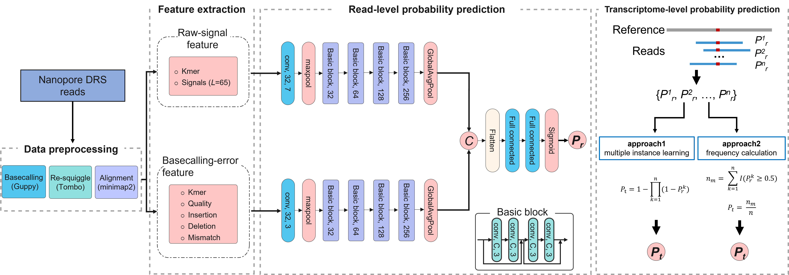

# RedNano


RedNano for detecting RNA m6A modification using nanopore direct RNA sequencing data. RedNano combines raw current signals and basecalling error features for detecting RNA m6A modification using nanopore direct RNA sequencing (DRS) data. RedNano designs different coding approaches and employs two different types of neural networks, bidirectional long short-term memory network and deep residual network, to capture information based on the unique characteristics of each feature. RedNano can accurately detect m6A modification sites at read and genome levels.





# Installation

### Clone repository

Download RedNano from the github repository

    git clone https://github.com/Derryxu/RedNano.git

### Install dependencies

Install conda environment

```
conda env create -f RedNano.yml
```

Following list shows the main environmental dependencies, please make sure the dependences are installed.

| soft or module | version |
| -------------- | ------- |
|Python | 3.7|
|Pytorch |  1.10.0 |
|CUDA Version |  11.1|
|ont-fast5-api | 4.0.2|
|ont-tombo | 1.5.1|
|minimap2 | 2.17|
|samtools | 1.7 |
|h5py | 3.4.0|
|statsmodels | 0.13.1|
|tqdm | 4.62.3|
|scikit-learn | 0.19.2|


# Usage

This section highlights the main functionalities of RedNano and the commands to run them.

### Preproccess

1. **Converts multi read FAST5 file(s) into single read FAST5 files.**

   When the downloaded Fast5 file(s) of raw nanopore sequencing reads contains multiple reads-id, use ont_fast5_api to split the multiple read Fast5 file(s) into single read Fast5 files.

```shell
multi_to_single_fast5 -i fast5/ -s fast5_single --recursive -t 30
```

2. **Basecalling using guppy (v3.1.5)**

```shell
guppy_basecaller -i fast5_single/ -r -s fast5_guppy --fast5_out -c rna_r9.4.1_70bps_hac.cfg --gpu_runners_per_device 2 --chunks_per_runner 2500 --device CUDA:0

cat *.fastq > test.fastq
```

3. **resquiggle raw signals**

   The tombo (v1.5.1) resquiggle referance.transcript.fa should not be genome file, it should be the referance gene fasta file.

```shell
tombo resquiggle --overwrite fast5_guppy/workspace/ --basecall-group Basecall_1D_001 referance.transcript.fa --fit-global-scale --include-event-stdev --corrected-group RawGenomeCorrected_001 --processes 30
```

4. **Map reads to reference transcriptome**

   Map the nanopore reads to reference transcriptome  using minimap2 (v2.17-r941)

   Convert the output BAM format files to TSV format files using samtools (v1.7) and sam2tsv 

```shell
minimap2 -t 30 -ax map-ont referance.transcript.fa fast5_guppy/test.fastq | samtools view -hSb | samtools sort -@ 30 -o test.bam
samtools index test.bam
samtools view -h -F 3844 test.bam | java -jar sam2tsv.jar -r referance.transcript.fa > test.tsv
```

4. **Split  test.tsv file**

   To allow downstream parallelisation of the feature extraction, the generated test.tsv is split into the different reads in a tmp folder.

```shell
mkdir tmp
awk 'NR==1{ h=$0 }NR>1{ print (!a[$2]++? h ORS $0 : $0) > "tmp/"$1".txt" }' test.tsv
```
### Feature extraction

With the data ready, we can now extract the combined features from the reads.

* Use `-k` to specify kmer length.

* Use `-s` to specify raw signals length.

* Use `-b` to specify transcriptome length file, for example:

  | ID                 | length |
  | ------------------ | ------ |
  | cc6m_2244_T7_ecorv | 2276   |

```shell
# Current directory: RedNano/
# Output folder: mkdir test/features/
python scripts/extract_features.py -i test/fast5_guppy/workspace/ -o test/features/ --errors_dir test/tmp/ --corrected_group RawGenomeCorrected_001 -b test/ referance.transcript.bed --w_is_dir 1 -k 5 -s 65 -n 30
```

The output feature file consists of one sample per row in the format shown below:

| chrom | pos  | alignstrand | loc_in_ref | readname | strand | k_mer | k_signals_rect | qual | mis  | ins  | dele |
| ----- | ---- | ----------- | ---------- | -------- | ------ | ----- | -------------- | ---- | ---- | ---- | ---- |


### Predicting m6A site

* Use `-test_option` to specify test file(s).

  [0]  `-test_file `:sigle test file 

  [1]  `-test_file_dir`: folder containing multiple test files

* Use `-model` to specify the checkpoint file while training model from checkpoints.

```shell

# --model 
CUDA_VISIBLE_DEVICES=5 python scripts/predict.py --test_option 0 --test_file test/test.txt --model test/model/early_stopping_model_states.pt --seq_lens 5 --signal_lens 65 --batch_size 512 --rnn_hid 128 --hidden_size 512 --dropout_rate 0.5 --embedding_size 4 --output_file_dir test/results/ --num_workers 2
```

* Output: Modified predicted probability file for the level of readings in the format shown below:

| chrom | pos  | alignstrand | loc_in_ref | readname | strand | k_mer | pred |
| ----- | ---- | ----------- | ---------- | -------- | ------ | ----- | ---- |

* The reads prediction modification probabilities are processed to calculate the predicted probability of genome level site m6 modifications

  公式mathtype

  

### Trainning model

Our tool allows training your own models using private data. After extracting the modified and unmodified sample features separately, you can add the label (0/1) column to the end of the feature file row, divide the sample set, etc. via the awk command.

```shell
awk -v OFS="\t" '{print $0, 1}' mod_features.txt > mod_features_labeled.txt
```

* Use `-test_option` to specify train file(s).

```shell
CUDA_VISIBLE_DEVICES=0 python scripts/train.py --train_option 0 --train_file test/train.txt --valid_file test/valid.txt --epochs 50 --patience 5 --signal_lens 65 --batch_size 512 --rnn_hid 128 --hidden_size 512 --dropout_rate 0.5 --clip_grad 0.5 --lr 1e-4 --weight_decay 1e-5 --embedding_size 4 --num_workers 2 --model_type basecall --save_dir test/results/ --seq_lens 5
```


# Publication

